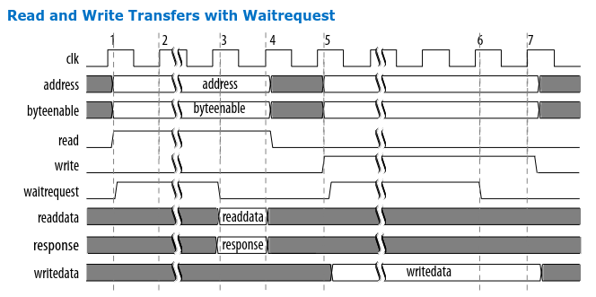

# Comparaison between WB et Avalon

In thisd comparaison we focus on the Avalon-MM (Avalon Memory-Mapped) specificaion and the Wishbone specification. The main differences between the two specifications are the following:

- **Addressing**: up to 64-bit addressing in Avalon-MM, no specific bounds in Wishbone.
- **Data Width**: 64-bits max in Wishbone, 8-1024 bits in Avalon-MM.
- **Handshaking**: Avalon-MM uses separate read and write signals, Wishbone uses a single one-bit signal.
- **Blocking & Non-Blocking transfer**: Avalon-MM has a separate signal for wait request ( Blocking transfer ), where in Wishbone the master is the one that decides to do the transfer (CYC and STB signals), then it's up to the slave to ack the transfer or request a retry (Non-Blocking transfer).
  The Avalon-MM uses a ready/valid handshake, while Wishbone uses an ACK/RTY.
- **Signals**: Avalon-MM has additional signals for flow control and error reporting. as response is a two bit signal, that can indicate 4 states: OKAY, RESERVED, SLVERR and DECODEERROR, Wishbone has ACK, ERR and RTY signals. The main difference here is that the signals DECODEERROR, RESERVED and SLVERR are merged to a single ERR signal in Wishbone, where the RTY signal is used to indicate that the master should retry the transaction. ACK is equivalent to OKAY, And the SEL signal (Transfer mask) is equivalent to byteenable in the Avalon protocol.

I can also add that the Avalon is a more complex protocol than Wishbone, and is used in more complex systems, while Wishbone is used in simpler systems, like the videao controller implemented previously.

# RAM sync Avalon en verilog


```verilog
module ram_sync_avalon(
    input wire clk,
    input wire reset,
    input wire [63:0] address,
    input wire [63:0] write_data,
    input wire write,
    input wire read,
    input wire byteenable,
    output wire [63:0] read_data,
    output wire wait_request,
    output wire response
);
    reg [63:0] ram [0:1023];

    always @(posedge clk) begin
        if (reset) begin
            ram <= '0;
            read_data <= '0;
            wait_request <= 0;
            response <= 0;
        end else begin
            if (write) begin
                if (byteenable == '1) begin
                    ram[address] <= write_data;
                end else begin
                    for (int i = 0; i < 8; i = i + 1) begin
                        if (byteenable[i] == 1'b1) begin
                            ram[address + i] <= write_data[i:i+7];
                        end
                    end
                end
            end else if (read) begin
                read_data <= ram[address]; // present for one cycle
                response <= 2'b00;
            end 
        end
        // We can add some wait_request logic here
    end

endmodule
```