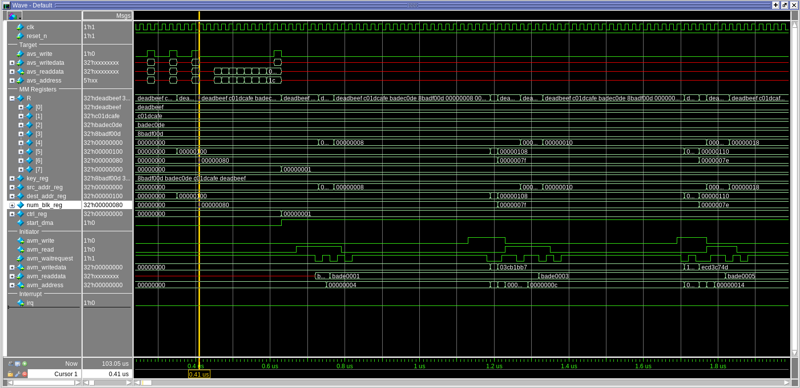
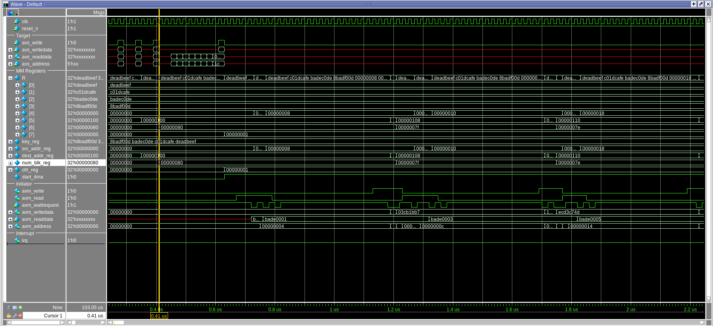

## 
## The encryption of one block takes 644 ms.
the verification of visual wave forms to ensure the right procedure of encryption and interation is done. And I provided some waveforms (reading, encrypting and writing one 64-bit word) :

