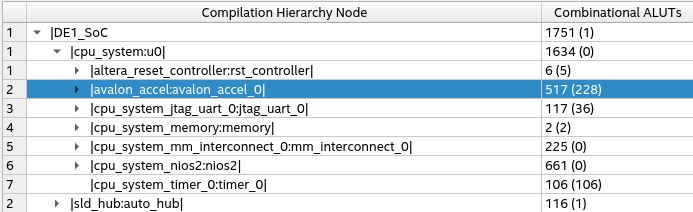
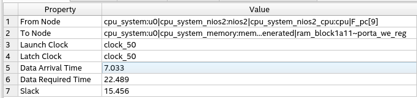
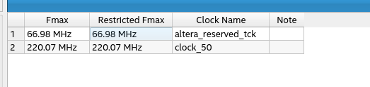

## 
#### The encryption of one block takes 644.
Compared to a software implementation running on nios2, it took 340664, so the advantage is significant as the hardware implementation is much faster.
compared to memcpy, the nios takes 957, to copy a 17 char string, which is normal as we should do $17*2$ memory reads and $17*2$ memory writes.

#### To compare the different sizes of the modules : 

We can see that the module accelerator has a high complexity as it takes $\frac{1}{3}$ of all the ALUTs used in the system, and it approches the size of the processor(nios2), where the interconnect takes only 225 LUT compared to 517 of the accelerator.

#### paths : 
The critical path: cpu_system:u0|cpu_system_nios2:nios2|cpu_system_nios2_cpu:cpu|F_pc[9]

### Maximal frequency : 

The verification of visual wave forms to ensure the right procedure of encryption and interation is done. And I provided some waveforms (reading, encrypting and writing one 64-bit word) :

